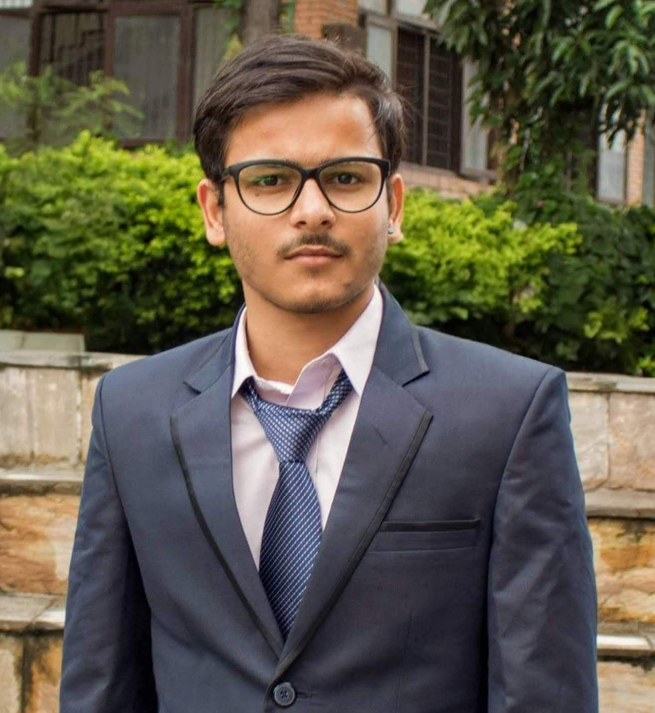

# Arjun Dahal 

## About Me

I am a PhD student in Computer Science & Engineering at the University of Texas at Arlington. My research focuses on Testing Machine Learning Models and Explainable Artificial Intelligence. 

- **Current Position:** PhD Student at the University of Texas at Arlington
- **Research Interests:** Testing, XAI

---

## Research

### Fairness Testing of Machine Learning Models
I am researching Novel methods to conduct Fairness testing of Black Box Machine Learning Models.

---

## Publications

Regmi, Paribesh, Arjun Dahal, and Basanta Joshi. "Nepali speech recognition using rnn-ctc model." International Journal of Computer Applications 178.31 (2019): 1-6.

### Nepali speech recognition using rnn-ctc model(#)
**Conference/Journal:** International Journal of Computer Applications | 2019

---

## Teaching

### Intermediate Programming(#)
**Institution:** University of Texas at Arlington | Fall 2022, Spring 2023

### Software Testing and Maintenance (#)
**Institution:** University of Texas at Arlington | Summer 2023

### Intemediate Programming (#)
**Institution:** University of Texas at Arlington | Fall 2023 

### Professional Practice (#)
**Institution:** University of Texas at Arlington | Spring 2024

### Fundamentals of Software Engineering (#)
**Institution:** University of Texas at Arlington | Summer 2024

I was a teaching assistant for the courses listed above. I would resolve students' queries during TA hours, make solutions to exams, and grade the exams.

## Skills

### Programming Languages
- Python, C, C++, Matlab, JavaScript, Java

### Tools and Frameworks
- Tensorflow, Pytorch, Matlab

### Research Methodologies
- Machine Learning, Data Analysis 

## Experience

### Solutions Engineer (#)
**Institution:** LogPoint | Dec 2018 - Aug 2022

I was responsible for troubleshooting and debugging issues related to LogPoint, unified SIEM and SOAR solution. I have hands on experience on troubleshooting issues related to Linux Systems: Networking, Storage, and Services. 

---

## Education

### PhD in Computer Science & Engineering
**Institution:** University of Texas at Arlington | May 2027

_A brief overview of your PhD studies, your dissertation topic, and any relevant coursework or research projects._

### Institute of Engineering(#)
**Institution:** Tribhuvan University | 2018

I pursed Electronics and Communication Engineering.
---

## Contact

- **Email:** [your-email@example.com](mailto:arjunatwork7@gmail.com)
- **LinkedIn:** https://www.linkedin.com/in/arjdahal/(#)
- **GitHub:** https://github.com/ajdahal(#)
- **Google Scholar:** https://scholar.google.com/citations?hl=en&user=fI9pyVIAAAAJ# (#)

---

